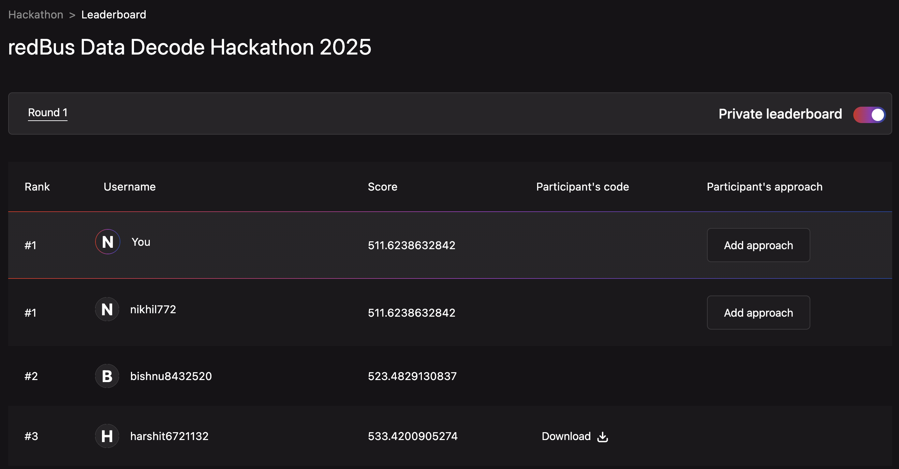

# 🏆 RedBus Analytics - Bus Seat Count Prediction
## 🥇 First Place Solution

<div align="center">
  
  
  
</div>

<div align="center">
  <h3>🏆 Championship Achievement</h3>
  
  <p><strong>🥇 First Place Achievement in RedBus Analytics Competition</strong></p>
  
  <p>
    <a href="https://www.analyticsvidhya.com/datahack/contest/redbus-data-decode-hackathon-2025/" target="_blank">
      
    </a>
  </p>
</div>

---

This repository contains the **🥇 first-place winning solution** for the [RedBus Data Decode Hackathon 2025](https://www.analyticsvidhya.com/datahack/contest/redbus-data-decode-hackathon-2025/) hosted by Analytics Vidhya. The solution leverages advanced machine learning techniques including gradient boosting ensembles and deep learning transformers to predict bus seat counts with high accuracy.

## 🚀 Quick Start

### 📥 Important: Clone with Submodules

When cloning this repository on a new machine, use:

```bash
git clone --recurse-submodules https://github.com/your-username/av_redbus.git
cd av_redbus
```

Or if you already cloned without submodules:

```bash
git submodule init
git submodule update
```

### 🔧 Option 1: First Time Setup and Execution

Run the complete setup and pipeline with a single command:

```bash
./setup_and_run.sh
```

This script will:
1. 🐍 Create a virtual environment (`redbus_env`)
2. 📦 Install all required dependencies
3. 🔗 Initialize TabDPT submodule and install with model weights
4. ⚡ Run the complete pipeline (features → models → ensemble)
5. 📄 Generate final submission file

### 🔄 Option 2: Run Pipeline Only (After Setup)

If you've already run setup once and just want to re-run the pipeline:

```bash
./run_pipeline.sh
```

This script will:
1. ✅ Activate the existing virtual environment
2. 🔍 Verify all dependencies are installed
3. 🚀 Run the complete pipeline without reinstalling anything
4. 📊 Generate fresh submission file

### ⚙️ Option 3: Manual Setup

If you prefer manual control:

```bash
# 1. Create and activate virtual environment
python3 -m venv redbus_env
source redbus_env/bin/activate

# 2. Install dependencies
pip install -r requirements.txt

# 3. Install TabDPT
git clone https://github.com/layer6ai-labs/TabDPT.git
cd TabDPT
git lfs pull
pip install -e .
cd ..

# 4. Run pipeline
cd src
python generate_features.py
python gbm_model.py
python tabdpt_model.py
python ensemble.py
```

## 📁 Data Requirements

Place your competition data files in these exact locations:
```
📂 data/
├── 📂 train/
│   ├── 📄 train.csv
│   └── 📄 transactions.csv
├── 📄 test_8gqdJqH.csv
└── 📄 sample_submission_TQv3O0x.csv
```

**📝 Note**: The setup script will also create:
- `redbus_env/` - 🐍 Virtual environment 
- `TabDPT/` - 🤖 TabDPT model repository (cloned automatically)

## 📊 Pipeline Output

The pipeline generates these key files in `outputs/`:

1. **🔧 Feature Engineering**: `optimized_dataset_top6k_features.ipc`, `feature_importance_v8_fixed.csv`
2. **🤖 Model Submissions**: 
   - `submission_baseline_v17_filtered.csv` (GBM ensemble)
   - `submission_baseline_tabdpt_model.csv` (TabDPT model)
3. **🏆 Final Submission**: `submission_ensemble_v17_tabdpt_75_25.csv` ⭐

## 💻 System Requirements (Tested Configuration)

- **CPU**: Intel Xeon @ 2.20GHz (6 cores, 12 threads)
- **RAM**: 83 GB (actual usage peaks around 30-40 GB during feature engineering)
- **GPU**: NVIDIA A100-SXM4-40GB (optional but significantly speeds up TabDPT training)
- **Storage**: ~10 GB free space for data, models, and outputs
- **OS**: Linux (Ubuntu 22.04 or similar)
- **Python**: 3.10.12
- **Dependencies**: Git with Git LFS support, Internet connection for initial setup

## 🧠 Solution Summary

### 📈 Validation Strategy
- **⏰ Time-based splits**: 60-day test holdout window, 60-day validation window
- **🛡️ Data leakage prevention**: Trains only on past data to predict future


### 🔧 Feature Engineering & Selection
- **📊 Scale**: Generates ~35K features from transaction history, temporal patterns, route statistics
- **💳 Transaction Features**: Booking velocity, conversion rates, search-to-booking ratios, cumulative patterns
- **📅 Temporal Features**: Holiday proximity, day-of-week effects, seasonal patterns, booking lead time analysis  
- **🛣️ Route Features**: Historical performance, popularity metrics, tier-based characteristics, regional patterns
- **⚡ Advanced Features**: Rolling statistics, lag features, acceleration metrics, momentum scores
- **📈 Statistical Aggregations**: Mean/std/median by route-date combinations, rank features, growth rates
- **🎯 Multi-Scale Testing**: Tests multiple feature sets (**1K, 2K, 3K, and 6K**) using LightGBM importance scores
- **⚖️ Optimal Balance**: 6K features achieve best performance balancing model complexity and predictive power

### 🤖 Model Architecture
1. **🌲 GBM Ensemble**: Combines LightGBM, XGBoost, and CatBoost
2. **🧠 TabDPT**: Deep learning transformer specifically designed for tabular data
3. **🎯 Final Ensemble**: 75% GBM predictions + 25% TabDPT predictions

### 💡 Key Innovation
🔬 Multi-scale feature testing (1K-6K) enables optimal feature-model complexity balance discovery

## 🛠️ Troubleshooting

**🤖 TabDPT Installation Issues:**
- Ensure Git LFS is installed: `git lfs --version`
- On Ubuntu: `sudo apt-get install git-lfs`

**💾 Memory Issues:**
- Close other applications

**🎮 GPU Issues:**
- TabDPT will fallback to CPU automatically
- Install CUDA for better performance

## 📈 Final Results

<div align="center">
  
  
</div>

### 🌲 Gradient Boosting Models (Test RMSE)

| 📊 Feature Set | 🚀 LightGBM | ⚡ XGBoost | 🐱 CatBoost |
|---------------|-------------|-----------|-------------|
| **1K Features** | **474.97** | 477.77 | **473.02** |
| **2K Features** | 482.61 | 477.43 | **466.95** |
| **3K Features** | **471.82** | **473.11** | 485.32 |
| **6K Features** | 495.96 | **481.41** | **479.74** |

**🎯 GBM Ensemble (V17)**: **462.73** (12 models combined)

### 🧠 TabDPT Models (Test RMSE)

| 🔧 Model Configuration | 📊 RMSE | 🎯 Features |
|------------------------|---------|-------------|
| TabDPT Top 1K Features | **455.68** | 1,000 |
| TabDPT Top 2K Features | **456.37** | 2,000 |
| TabDPT Top 3K Features | 488.99 | 3,000 |
| TabDPT Top 6K Features | 478.84 | 6,000 |
| **🏆 TabDPT Ensemble** | **🥇 451.73** | All feature sets |

### 🏆 Final Submission
- **🏗️ Architecture**: V17 GBM Ensemble (75%) + TabDPT (25%)
- **📄 Submission File**: `outputs/submission_ensemble_v17_tabdpt_75_25.csv`

## 🎯 Competition Submission

Submit the final file: `outputs/submission_ensemble_v17_tabdpt_75_25.csv`

---

<div align="center">
  
  
  
  <p><em>🚀 Advancing the state-of-the-art in tabular machine learning</em></p>
</div>